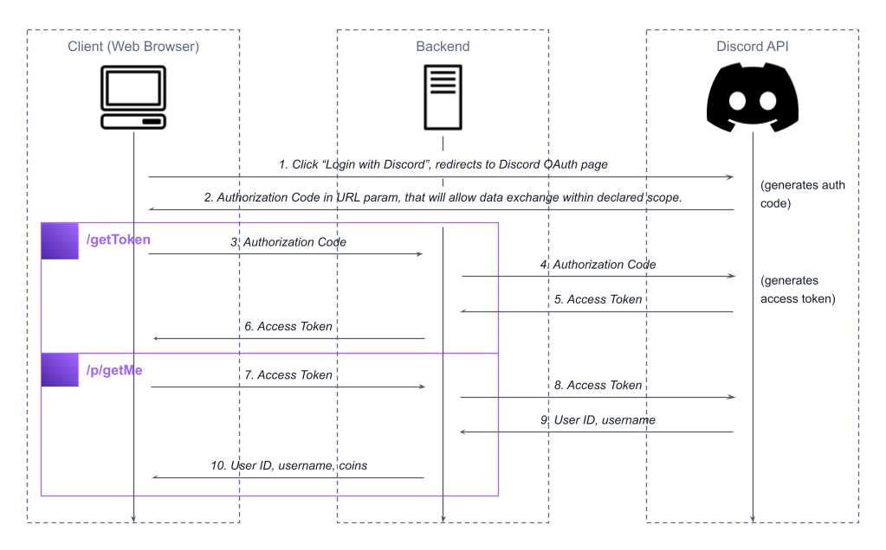

# Login with Discord
Implementation of Discord OAuth2 API. Consists of HTML/Vanilla.js frontend and Express.js backend. Allows to login using Discord account.

**Complementary repository to Medium article: https://levelup.gitconnected.com/create-login-with-discord-in-express-js-in-10-minutes-6eaeab4ba174**

## Data Flow


## Requirements
- Node.js v16<=
- npm/yarn

## Usage
1. Create Discord OAuth2 Application with redirect in Discord Developer Portal
2. Fill `backend/.env` based on `backend/.env.example`
3. Fill `frontend/index.html` with generated OAuth URL in "Discord Login" button href (line 14)
4. Install and run backend
```
cd backend
npm i
node app.js
```
5. Visit http://localhost:3000

## Details
More details in the Medium article: https://levelup.gitconnected.com/create-login-with-discord-in-express-js-in-10-minutes-6eaeab4ba174
